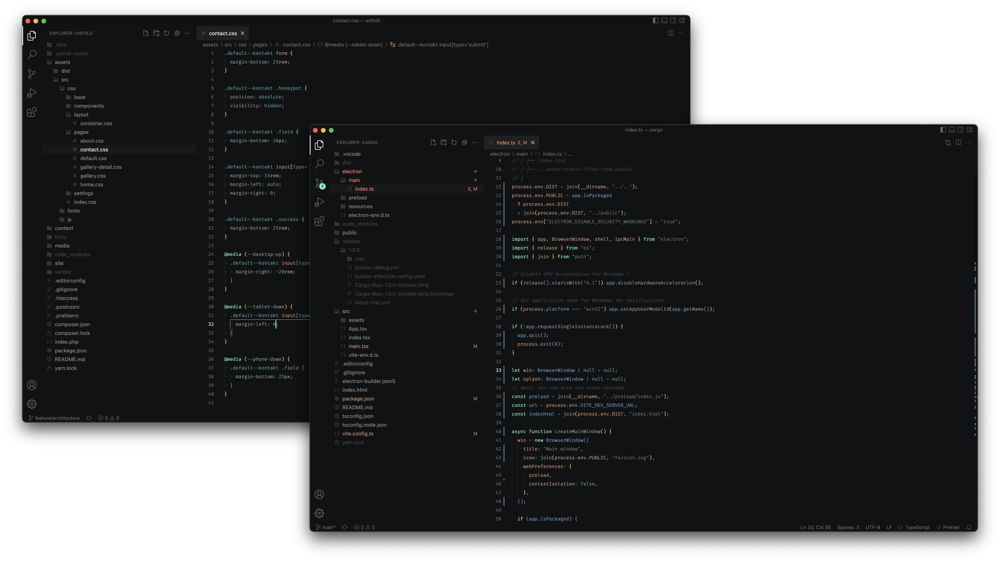

  

A dark and minimal theme for Visual Studio Code.

  

### Quick Start

Open the [extension marketplace](https://code.visualstudio.com/docs/editor/extension-gallery) by clicking on the Extensions icon in the Activity Bar. Search for `mint` and click on the <kbd>Install</kbd> button.

#### Activation

To activate the theme click on the gear icon in the _Activity Bar_ and select _Color Theme_. Search for `mint` and confirm the color theme change with <kbd>Enter</kbd>.

See Nord Visual Studio Code's documentation for details about [more activation options][nord-docs-home-install#activation].

  Copyright © 2020-present <a href="https://github.com/marcbruederlin">Marc Brüderlin</a>
    
  

